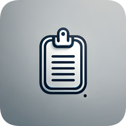

#  ClipFile  

## 🔥 Overview  

ClipFile is a cross-platform app that enables seamless clipboard synchronization and file sharing between devices. Built using Flutter, it supports Windows, Android, and iOS, making it easy to transfer text and files effortlessly.  

## 🚀 Features  
- **Clipboard Syncing**: Copy text on one device, paste it on another.  
- **File & Image Sharing**: Transfer files and images across your devices.  
- **Quick Actions**: Easily navigate through the app using home screen shortcuts.  
- **Appwrite Backend**: Stores clipboard data and files.  
- **Drag & Drop Support**:  
  - **Windows**: Full drag-and-drop support for text, files, and images.  
  - **Android & iOS**: Partial drag-and-drop support due to platform limitations.  

## 🛠️ Tech Stack  
ClipFile is built using Flutter and relies on the following key packages:  
- **[Appwrite](https://appwrite.io/)** - Backend for clipboard data & file storage.  
- **[Google Fonts](https://pub.dev/packages/google_fonts)** - Custom fonts for a better UI experience.  
- **[Provider](https://pub.dev/packages/provider)** - State management for efficient app performance.  
- **[Liquid Pull to Refresh](https://pub.dev/packages/liquid_pull_to_refresh)** - A smooth and clean refresh indicator.  
- **[Hive Flutter](https://pub.dev/packages/hive_flutter)** - Local storage for app settings.  
- **[File Picker](https://pub.dev/packages/file_picker)** - Select files for sharing.  
- **[Image Picker](https://pub.dev/packages/image_picker)** - Choose images from the gallery or camera.  
- **[Quick Actions](https://pub.dev/packages/quick_actions)** - Home screen shortcuts for quick navigation.  
- **[Restart App](https://pub.dev/packages/restart_app)** - Restart the app programmatically when required.  
- **[Smooth Page Indicator](https://pub.dev/packages/smooth_page_indicator)** - Displays page indicators for navigation.  
- **[Super Drag & Drop](https://pub.dev/packages/super_drag_and_drop)** - Enables drag-and-drop support across platforms.  

## 🏗️ Installation  
You can use ClipFile with Appwrite's cloud services or self-host it via Docker.  

### 📌 Using Appwrite Cloud  
1. Register for an account on [Appwrite Cloud](https://cloud.appwrite.io/). The free tier is sufficient for basic usage.  
2. Create a new project and assign it a preferred name.  
3. Select an available region to host the project.  
4. Add **Flutter** as a platform for the project.  
5. When prompted for a package name registration, select the platform(s) intended for use:  
   - **Android/iOS**: Use `com.example.clipfile`.  
   - **Windows**: Use `clipfile`.  
6. Assign any desired application name.  
7. Skip any optional setup steps.  
8. Navigate to the **Database** section and create a new database.  
9. Within the newly created database, establish a **Collection**.  
10. Add a **String Attribute** with a defined maximum size.  
11. Create a **Document** containing the specified attribute.  
12. Proceed to the **Storage** section and generate a **Bucket**.  
13. Access the bucket settings and grant permissions to the **Any** role, enabling the **Create, Read, Update, and Delete** options.  
14. Apply the same permission settings within **Databases → Collections → Documents**.  
15. Retrieve and store the following identifiers, as they will be required during the initial app setup:  
    - **Project ID**  
    - **Database ID**  
    - **Collection ID**  
    - **Attribute Name**  
    - **Document ID**  
    - **Bucket ID**  
16. If utilizing Appwrite Cloud, set the API endpoint to `https://cloud.appwrite.io/v1`.  

### 🏠 Self-Hosting with Appwrite  
Follow the official guide [here](https://appwrite.io/docs/advanced/self-hosting).  

### 💻 Installing ClipFile on Windows (.msix)  
If installing the app using the `.msix` package, follow these steps to trust the self-signed certificate and install the app:  

#### 1️⃣ Obtain and Install the Certificate  
1. Right-click on the `.appx` or `.msix` file.  
2. Click **Properties**.  
3. Go to the **Digital Signatures** tab.  
4. Select the signature from the list and click **Details**.  
5. Click **View Certificate**.  
6. Click **Install Certificate**.  
7. In the **Certificate Import Wizard**, select **Local Machine**.  
8. Click **Next** and confirm the UAC prompt.  
9. Select **Place all certificates in the following store**.  
10. Click **Browse**, scroll down, and select **Trusted People**.  
11. Click **OK**, then **Next**, and finally **Finish**.  
12. If a confirmation dialog appears, click **OK**.  

#### 2️⃣ Install the App Package  
1. Open the folder containing the `.msix` package.  
2. Double-click the package to begin the installation.  
3. Follow the on-screen instructions to complete the installation.  
4. Launch **ClipFile** and start using it!  

## 📖 Usage  
1. Install ClipFile on all your devices.  
2. Set up the app as specified above.  
3. Start copying, pasting, dragging, and sharing files seamlessly!  

## 🐛 Issues & Feedback  
Found a bug or have a feature request? Open an issue [here](https://github.com/Ram3ez/ClipFile/issues)!  

---  
💙 Enjoy using ClipFile? Consider giving the repo a ⭐ to support development!  
